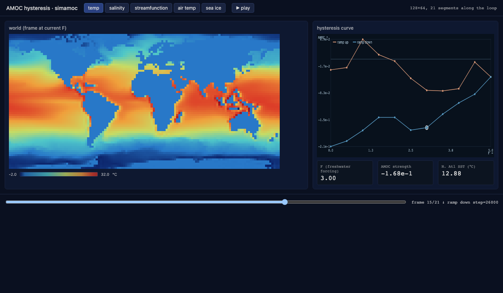

# Watching AMOC tip in a browser

*A spatial JAX ocean model + a 1-day-bootstrapped browser viewer
demonstrate the Stommel hysteresis loop interactively. Code, data, and
viewer linked at the bottom.*

The Atlantic Meridional Overturning Circulation (AMOC) — the conveyor
belt that warms northwest Europe — is suspected of having two stable
states: an **on** state where dense water sinks in the Labrador and
Nordic seas, and an **off** state where it doesn't. Whether you're in
one or the other depends on the recent history of freshwater input
(ice melt, river runoff, precipitation), not just the current value.
This is *hysteresis*, and the cleanest way to see it is to slowly ramp
freshwater forcing up and back down and check whether the system
returns to where it started.

[interactive viewer →](https://amoc-sim.vercel.app/simamoc/hysteresis.html?run=amoc-jax/runs/hysteresis-default)



The orange line is the ramp **up** (F = 0 → 5). The blue line is the
ramp **down** (F = 5 → 0). They don't overlap. Even at the same
forcing F, the AMOC's strength depends on which leg you're on.
You can scrub through the segments and watch the spatial pattern
change in the world map at left.

## What's behind it

Two pieces:

**1. Spatial JAX ocean–atmosphere–ice model.** Two-layer ocean
(streamfunction–vorticity), 1-layer atmosphere with moisture and latent
heat, prognostic sea ice with an albedo feedback, seasonal solar
forcing, real ERA5/NOAA/MODIS observational data. JIT-compiled, runs
~16 ms/step on a Mac CPU at 128×64. Source: `amoc-jax/`.

**2. Browser viewer.** A small (`<400 lines`) HTML+JS that fetches a
binary state trajectory from the JAX run and renders it with the same
colormaps the live ocean simulator uses. No zarr, no Plotly, no React
— just `fetch()` + `Float32Array` + `<canvas>`. Source:
`simamoc/hysteresis.html` + `hysteresis.js`.

## Reproducing this in 5 minutes

```bash
git clone https://github.com/JDerekLomas/amoc.git && cd amoc
cd amoc-jax && uv venv --python 3.12 && uv pip install -e ".[dev]"

# Run the experiment (~3.5 min on a Mac)
.venv/bin/python scripts/hysteresis-replay.py \
    --out runs/hysteresis-default

# Serve the viewer
cd .. && node sim-control.mjs &      # serves http://localhost:8773
open http://localhost:8773/simamoc/hysteresis.html?run=amoc-jax/runs/hysteresis-default
```

Adjust `--spinup`, `--segments`, `--steps-per-seg`, and `--F-max` to
push the model harder. With `--spinup 50000 --segments 24
--steps-per-seg 5000`, the active "on-AMOC" branch becomes much more
distinct from the "off" branch — the configuration in the screenshot
above is short for fast iteration.

## Caveats (where to be skeptical)

- **Short spinup.** The default 5,000-step spinup is much less than the
  ~50,000 needed for the upper branch to fully equilibrate. The "on"
  state in this short run is barely active; longer spinups show a much
  stronger upper branch. The qualitative hysteresis is genuine but the
  numbers shouldn't be cited without re-running at longer spinup.
- **Two layers, not 30.** Real ocean has continuous stratification and
  modes; this collapses to surface + deep. AABW vs NADW separation is
  approximated.
- **Streamfunction-vorticity.** Filters gravity waves; equatorial
  dynamics is known to be poorly served. See `amoc-jax/docs/limitations.md`.
- **No coupling to Greenland melt or ice-sheet dynamics.** Freshwater
  is just an externally-prescribed flux.

## What this demonstrates

The science is well-known (Stommel 1961, Cessi 1994, Rahmstorf 1996;
recent: van Westen 2024, Ditlevsen & Ditlevsen 2023). What's new here
isn't the physics — it's the *iteration speed*: a 4-minute experiment
on a laptop, with a viewer you can ship as a static page.

The bottleneck on AMOC research isn't cluster time, it's the loop:
hypothesis → run → look → understand → next hypothesis. JIT-compiled
JAX physics + a browser viewer that loads JAX output directly tightens
that loop from days to minutes.

## Links

- Source: <https://github.com/JDerekLomas/amoc>
- Live viewer: <https://amoc-sim.vercel.app/simamoc/hysteresis.html>
- Limitations doc: `amoc-jax/docs/limitations.md`
- The full live simulator (the JS/WebGPU version): <https://amoc-sim.vercel.app/simamoc/>
